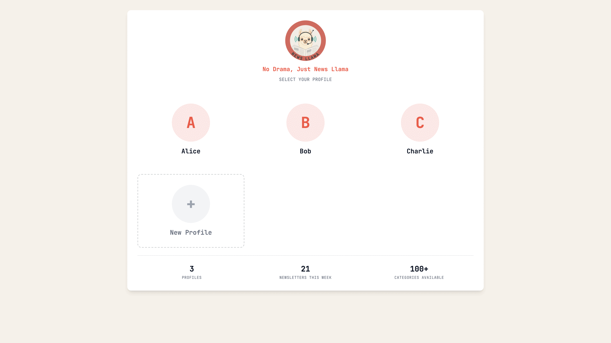

# News Llama 🦙📰

AI-powered news curation engine that aggregates content from RSS, Twitter/X, Hacker News, Reddit, and web search, then summarizes the most relevant articles using local LLM.



## Why News Llama?

Tired of doom-scrolling through endless feeds? News Llama curates a personalized daily digest based on *your* interests using AI-powered source discovery. It runs locally, keeps your reading habits private, and cuts through the noise with intelligent summarization. No ads, no tracking, no drama—just news.

## Features

- **AI-Powered Source Discovery**: Five-tier progressive discovery strategy with intelligent subreddit matching
- **Multi-Source Aggregation**: RSS, Twitter/X, Reddit (with smart time filtering for 24h top posts)
- **Smart Content Processing**: Duplicate detection, sentiment analysis, keyword extraction
- **Performance Optimized**: Pre-filters articles before LLM summarization (saves ~90% of LLM time!)
- **AI Summarization**: Local LLM-powered summarization via open-agent-sdk
- **Personalized Curation**: Discovery-only mode when interests provided (skips default sources)
- **Rich Output Formats**: Beautiful HTML, RSS, and JSON outputs
- **Environment-Based Config**: Secure dotenv configuration for easy deployment

## Quick Start

### 1. Setup the project

```bash
# Clone and setup
cd news-llama  # Navigate to your cloned repository
python setup.py

# Or manually:
pip install -r requirements.txt
cp .env.example .env  # Edit with your settings
```

### 2. Configure your environment

Edit `.env` file with your settings:

```bash
# LLM Configuration
LLM_API_URL=http://localhost:8000/v1
LLM_MODEL=llama-3.1-8b-instruct

# Optional: Social Media API Keys
TWITTER_API_KEY=your_twitter_api_key
REDDIT_CLIENT_ID=your_reddit_client_id

# Enable AI source discovery
ENABLE_LLM_SOURCE_DISCOVERY=true
```

### 3. Run with your interests

```bash
# Run once with default interests
python main.py

# Customize your interests
python main.py --interests AI "machine learning" rust startups

# Run in scheduled mode (uses SCHEDULER_* settings from .env)
python main.py --schedule

# Combine options
python main.py --interests AI programming --schedule
```

### 4. View your curated news

Your news digest will be generated in multiple formats:

- **HTML**: Open `output/news-YYYY-MM-DD.html` in your browser for a beautiful, responsive digest
- **JSON**: `output/news-YYYY-MM-DD.json` for programmatic access
- **RSS**: `output/news-YYYY-MM-DD.xml` for RSS readers

Configure which formats to generate in `.env` with `OUTPUT_FORMATS=html,rss,json`

## AI Source Discovery

News Llama uses a **five-tier progressive discovery strategy** with intelligent LLM-powered matching:

### Discovery Tiers (in order)

1. **Predefined Patterns**: Fast lookup for known topics (AI, rust, technology, etc.)
2. **LLM Subreddit Matching**: Focused discovery with temperature 0.3 to avoid false matches
   - Finds exact matches: "rust" → r/rust (NOT r/RustBelt)
   - Discovers variants: r/learnrust, r/rust_gamedev
   - Identifies specialized communities
3. **Broad LLM Discovery**: Multi-source discovery (Twitter, RSS feeds)
4. **Exact Match Fallback**: Tries r/{interest} directly
5. **Reddit Search**: Last resort across all subreddits

### Example Discoveries

**Interest: "AI"** → Discovers:
- **Reddit**: r/MachineLearning, r/LocalLLaMA, r/OpenAI, r/ClaudeAI, r/singularity
- **Twitter**: @sama, @ylecun, @karpathy, @fchollet, @openai
- **RSS**: OpenAI Blog, Anthropic News, DeepMind Blog

**Interest: "boxoffice"** → Discovers:
- **Reddit**: r/boxoffice, r/movies, r/movienews, r/film

**Interest: "rust"** → Discovers:
- **Reddit**: r/rust, r/learnrust, r/rust_gamedev
- **RSS**: This Week in Rust

## Project Structure

```
news-llama/
├── src/
│   ├── aggregators/         # Source-specific aggregators
│   │   ├── rss_aggregator.py
│   │   ├── twitter_aggregator.py
│   │   ├── reddit_aggregator.py
│   │   ├── hackernews_aggregator.py
│   │   └── dynamic_aggregator.py  # AI-discovered sources
│   ├── processors/          # Content processing
│   │   ├── content_processor.py
│   │   ├── duplicate_detector.py
│   │   └── source_discovery.py   # LLM source discovery
│   ├── summarizers/         # LLM summarization
│   ├── generators/          # Output generation
│   └── utils/              # Configuration and models
├── config/                 # Configuration templates
├── output/                 # Generated content
├── templates/              # HTML templates
├── tests/                  # Test suite
├── .env.example           # Environment variables template
└── setup.py               # Automated setup script
```

## Performance

News Llama is optimized for speed with **intelligent pre-filtering**:

### Real Performance Example

**10 interests** (AI, rust, LocalLLM, boxoffice, television, movies, etc.):

```
Collection:    678 total articles
Deduplication: 661 unique articles
Pre-filtering: 100 articles (10 per category)
Summarized:    100 articles
Valid output:  78 articles
LLM time:     ~21 minutes
```

**Without pre-filtering**: Would have taken ~2 hours to summarize all 661 articles!

### How It Works

1. **Smart Scoring**: Ranks articles by recency + content quality + Reddit score
2. **Category Limits**: Keeps top N articles per category (default: 10)
3. **LLM Efficiency**: Only summarizes articles that will be displayed
4. **Result**: ~90% reduction in LLM processing time

## Configuration

### Key Environment Variables

```bash
# LLM Configuration
LLM_API_URL=http://localhost:8000/v1
LLM_MODEL=llama-3.1-8b-instruct
LLM_TEMPERATURE=0.7
LLM_MAX_TOKENS=4000

# Reddit API (required for Reddit sources)
REDDIT_CLIENT_ID=your_client_id
REDDIT_CLIENT_SECRET=your_client_secret
REDDIT_USERNAME=your_username
REDDIT_PASSWORD=your_password

# Output Settings
MAX_ARTICLES_PER_CATEGORY=10  # Articles to show per category
OUTPUT_FORMATS=html,rss,json
```

See `.env.example` for all available options:

- **LLM Settings**: API URL, model, temperature, tokens
- **Social Media**: Twitter and Reddit API keys
- **Processing**: Duplicate thresholds, sentiment analysis, article age limits
- **Output**: Formats, directories, articles per category
- **Discovery**: AI source discovery settings

### User Interests

Define your interests when initializing News Llama:

```python
interests = [
    "AI", "machine learning", "startups", 
    "python programming", "technology news"
]

news_llama = NewsLlama(user_interests=interests)
```

## Web Application

News Llama includes a modern web interface for managing multiple user profiles, interests, and personalized newsletters.

### Features

- **Multi-User Profiles**: Create and manage multiple users with individual interests
- **Newsletter Calendar**: View all your newsletters organized by month
- **Interest Management**: Add/remove interests with instant newsletter regeneration
- **Background Scheduler**: Automatic daily newsletter generation at configured time
- **Performance Optimized**: Database indexes, rate limiting, and LRU file caching
- **Beautiful UI**: Responsive design with warm coral accents and smooth interactions

### Quick Start

#### 1. Install Dependencies

```bash
# Install all dependencies including web requirements
pip install -r requirements.txt
```

#### 2. Initialize Database

```bash
# Run Alembic migrations to create database schema
TESTING=true ./venv/bin/alembic upgrade head
```

#### 3. Configure Environment

Add web-specific settings to your `.env` file:

```bash
# Scheduler Configuration
SCHEDULER_ENABLED=true
SCHEDULER_HOUR=6              # Generate at 6 AM
SCHEDULER_MINUTE=0
SCHEDULER_TIMEZONE=America/Los_Angeles

# Database
DATABASE_URL=sqlite:///./news_llama.db

# Web Server (optional, defaults shown)
# HOST=127.0.0.1
# PORT=8000
```

#### 4. Start the Server

```bash
# Production mode
./venv/bin/uvicorn src.web.app:app --host 0.0.0.0 --port 8000

# Development mode (auto-reload)
./venv/bin/uvicorn src.web.app:app --reload --port 8000
```

#### 5. Open in Browser

Navigate to `http://localhost:8000` to access the web interface.

### Usage Guide

#### Creating Your Profile

1. **Visit Homepage**: Select "Create New Profile"
2. **Enter Name**: Provide your first name
3. **Select Interests**: Choose from predefined interests or add custom ones
4. **Submit**: Your first newsletter will be queued for generation (takes 10-15 minutes)

#### Managing Interests

1. **Access Settings**: Click your profile icon → "Profile Settings"
2. **Add Interests**: Type or select from available interests
3. **Remove Interests**: Click the × on any interest tag
4. **Auto-Regeneration**: Today's newsletter automatically regenerates when interests change

#### Viewing Newsletters

1. **Calendar View**: See all newsletters organized by month
2. **Status Indicators**:
   - 🟢 **Completed**: Ready to view
   - 🟡 **Generating**: Processing (may take 10-15 minutes)
   - 🔴 **Failed**: Click to retry
3. **Click Date**: View the newsletter for that day
4. **Generate New**: Click any empty date to queue a newsletter

#### Background Automation

The scheduler automatically generates newsletters daily at your configured time:

- **Default**: 6:00 AM Pacific Time
- **Configurable**: Set `SCHEDULER_HOUR`, `SCHEDULER_MINUTE`, `SCHEDULER_TIMEZONE` in `.env`
- **Per-User**: Generates for all users with interests
- **Retry Logic**: Automatically retries failed generations (max 3 attempts)

Check scheduler status: `http://localhost:8000/health/scheduler`

### Architecture

Built with **FastAPI**, **SQLAlchemy**, **SQLite** (WAL mode), **Alembic** migrations, and **APScheduler** for background jobs.

**Key Components**:
- **Database**: 3 tables (Users, UserInterests, Newsletters) with optimized indexes
- **Service Layer**: 5 services (user, interest, newsletter, generation, scheduler)
- **API**: RESTful endpoints with cookie-based sessions
- **Performance**: Database indexes, rate limiting, LRU file caching, eager loading

**API Endpoints**:
- **Pages**: `/`, `/profile/new`, `/calendar`, `/profile/settings`, `/newsletters/{guid}`
- **API**: Profile creation/updates, interest management, newsletter generation/retry, health checks

**Error Handling**: User-friendly messages for all scenarios, no stack traces exposed.

For detailed architecture documentation, see [docs/architecture.md](docs/architecture.md).

### Configuration Reference

#### Web-Specific Environment Variables

```bash
# Database
DATABASE_URL=sqlite:///./news_llama.db

# Scheduler
SCHEDULER_ENABLED=true          # Enable/disable background scheduler
SCHEDULER_HOUR=6                # Hour for daily generation (0-23)
SCHEDULER_MINUTE=0              # Minute for daily generation (0-59)
SCHEDULER_TIMEZONE=America/Los_Angeles  # Timezone for scheduler

# Server (optional, passed to uvicorn)
# HOST=127.0.0.0
# PORT=8000

# Testing (disable scheduler during tests)
TESTING=false
```

All CLI configuration options (LLM, social media, processing) still apply to web mode.

### Deployment

For production deployment (systemd, nginx, backups), see [docs/deployment.md](docs/deployment.md).

For end-user documentation, see [docs/user-guide.md](docs/user-guide.md).

For technical architecture details, see [docs/architecture.md](docs/architecture.md).

## 🔧 Development

### Development Commands

```bash
# Install development dependencies
./dev.sh install

# Run tests
./dev.sh test

# Run with coverage
./dev.sh test-coverage

# Lint code
./dev.sh lint

# Format code
./dev.sh format

# Run the application
./dev.sh run
```

### Testing

#### CLI Tests

```bash
# Run CLI/batch mode tests
pytest tests/unit/

# Run specific test
pytest tests/unit/test_models.py
```

#### Web Tests

```bash
# Run all web tests
TESTING=true PYTHONPATH=. pytest tests/web/unit/

# Run with coverage
TESTING=true PYTHONPATH=. pytest tests/web/unit/ --cov=src/web --cov-report=html

# Run specific test file
TESTING=true PYTHONPATH=. pytest tests/web/unit/test_services.py
```

**Note**: Set `TESTING=true` to disable background scheduler during tests.

#### Test Structure

```
tests/
├── unit/                      # CLI/batch mode tests
│   ├── test_models.py
│   ├── test_content_processor.py
│   ├── test_duplicate_detector.py
│   ├── test_security.py
│   └── test_integration.py
└── web/
    └── unit/                  # Web application tests
        ├── conftest.py        # Shared fixtures
        ├── test_models.py     # SQLAlchemy models
        ├── test_database.py   # Database setup
        ├── test_services.py   # Service layer (5 test classes)
        ├── test_routes.py     # API endpoints (6 test classes)
        ├── test_performance.py  # Indexes, rate limiting, caching
        ├── test_error_handlers.py  # Error handling
        ├── test_ui_states.py  # Empty states, loading, validation
        └── test_generation_service.py  # Newsletter generation
```

**Coverage Target**: 80%+ for src/web/ (250+ tests, 99%+ pass rate)

## 📊 Output Examples

### HTML Digest Features
- **Personalized Header**: Shows your interests and discovery stats
- **Smart Categories**: Articles grouped by topic with AI ranking
- **Rich Article Cards**: Summaries, key points, sentiment, importance
- **Discovery Badges**: Highlights AI-discovered sources
- **Responsive Design**: Mobile-friendly layout

### Article Information
- **AI-generated summaries**: Concise summaries and 5-7 key bullet points
- **Sentiment analysis**: 0-100% score based on article language tone
  - 0-40%: Negative sentiment
  - 40-60%: Neutral/factual
  - 60-100%: Positive sentiment
- **Importance scoring**: LLM-generated 0.0-1.0 relevance score
- **Reading time estimates**: Based on word count
- **Source attribution**: Shows original source + discovery reasoning
- **Quality indicators**: Reddit scores, upvote ratios for social content

## LLM Integration

News Llama uses the **open-agent-sdk** for local LLM integration:

### Source Discovery
The LLM analyzes your interests and suggests relevant sources across platforms, with confidence scoring and reasoning.

### Content Summarization
Each article is summarized with:
- ~500-word summary
- 5-7 key bullet points
- Importance score (0.1-1.0)

### Smart Reasoning
- Identifies authoritative sources
- Understands topic relationships
- Adapts to current trends

### Open Agent SDK Integration (Showcase)
- Streaming completions with `AgentOptions` (model, base_url, temperature, max_tokens)
- JSON-first prompting: assistants return strictly-JSON payloads that we parse
- Tool use flow in discovery: a `web_search` tool (DuckDuckGo) is available to the agent
- Tool execution is mediated via `ToolUseBlock`/`add_tool_result`, then the agent returns a final JSON result

Minimal configuration (env):
```bash
LLM_API_URL=http://localhost:8000/v1
LLM_MODEL=llama-3.1-8b-instruct
LLM_TEMPERATURE=0.7
LLM_MAX_TOKENS=4000
```

#### Code excerpts

Summarization (streaming JSON result):
```python
from open_agent.types import AgentOptions
from open_agent import client as oa_client, TextBlock

options = AgentOptions(
    system_prompt=(
        "You are a precise news summarization assistant. "
        "Always return valid JSON exactly matching the requested schema and nothing else."
    ),
    model=config.llm.model,
    base_url=config.llm.api_url,
    temperature=config.llm.temperature,
    max_tokens=config.llm.max_tokens,
    api_key="not-needed",
)

text_parts = []
async for msg in oa_client.query(prompt, options):
    for block in msg.content:
        if isinstance(block, TextBlock):
            text_parts.append(block.text)
```

Tool use (source discovery with `web_search`):
```python
from open_agent import Client, TextBlock, ToolUseBlock, ToolUseError
from open_agent.types import AgentOptions
from open_agent.tools import Tool

async def web_search_handler(params):
    # run DuckDuckGo search and return {"results": [{"title":..., "url":...}, ...]}
    ...

tool = Tool(
    name='web_search',
    description='Search the web for recent sources related to a topic',
    input_schema={'query': str, 'max_results': int},
    handler=web_search_handler,
)

options = AgentOptions(
    system_prompt=(
        "You are an expert source discovery assistant. You can call the web_search tool when needed."
    ),
    model=config.llm.model,
    base_url=config.llm.api_url,
    tools=[tool],
    auto_execute_tools=False,
    api_key="not-needed",
)

client = Client(options)
await client.query(prompt)
async for block in client.receive_messages():
    if isinstance(block, TextBlock):
        ... # collect final JSON
    elif isinstance(block, ToolUseBlock):
        result = await web_search_handler(block.input)
        await client.add_tool_result(block.id, result, name=block.name)
    elif isinstance(block, ToolUseError):
        ... # log tool error
await client.close()
```

## Security & Privacy

- **Local Processing**: All processing happens locally
- **No Data Sharing**: Your interests and reading habits stay private
- **Environment Variables**: Secure API key management
- **Open Source**: Transparent and auditable code

## Known Limitations

- **Failed Content Extraction**: ~20-25% of articles fail extraction (paywalls, dead links, image-only posts). These are automatically filtered out.
- **RSS Feed Errors**: Some discovered RSS feeds may return 404s (sites change URLs over time). This is normal and logged as warnings.
- **Reddit Time Window**: Uses 24-hour `time_filter='day'` for top posts. Very low-activity subreddits may return 0 posts.
- **No NSFW Support**: Intentionally excluded due to Reddit API limitations on restricted/quarantined subreddit access.

## Contributing

1. Fork the repository
2. Create a feature branch
3. Make your changes
4. Add tests if applicable
5. Run linting and tests
6. Submit a pull request

### Adding New Sources

1. Create a new aggregator in `src/aggregators/`
2. Inherit from `BaseAggregator`
3. Implement `collect()` and `_is_valid_article()`
4. Add to the main aggregation loop

## License

This project is open source. See LICENSE file for details.

## Acknowledgments

- **open-agent-sdk**: Local LLM integration with tool use
- **asyncpraw**: Async Reddit API client
- **Feedparser**: RSS feed parsing
- **TextBlob**: Sentiment analysis and keyword extraction
- **Pydantic**: Data validation and settings management
- **Jinja2**: Beautiful HTML template rendering